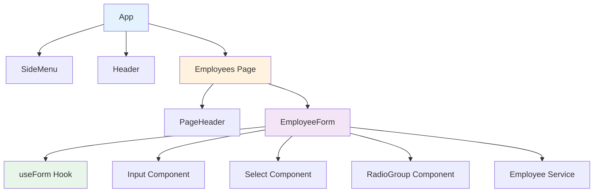
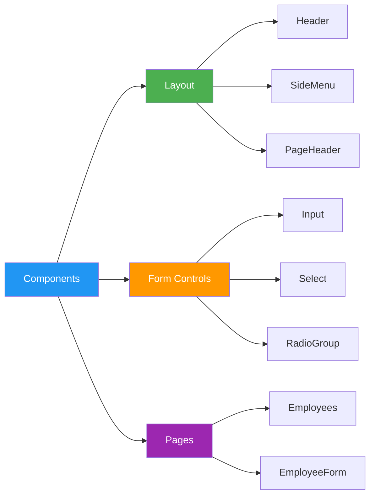

# Material UI Admin Dashboard

A React-based admin dashboard built with Material-UI, demonstrating modern form design, validation, and employee management interface.

Built in June 2021 as a workflow project following the tutorial by [CodAffection](https://www.youtube.com/watch?v=m-2_gb_3L7Q).

## Features

- 📋 Employee management form with comprehensive validation
- 🎨 Material Design UI components
- 📱 Responsive layout for all devices
- ✨ Custom reusable form components (Input, Select, RadioGroup)
- 🔄 Custom React hooks for form state management
- 🎯 Clean component architecture
- 🖥️ Side navigation menu
- 📊 Admin dashboard layout

## Architecture



## Component Architecture



## Getting Started

### Prerequisites

- Node.js (v14 or higher)
- npm or yarn

### Installation

1. Clone the repository:
```bash
git clone https://github.com/orassayag/material-ui-admin.git
cd material-ui-admin/material-ui-admin-1
```

2. Install dependencies:
```bash
npm install
```

3. Start the development server:
```bash
npm start
```

4. Open your browser and navigate to [http://localhost:3000](http://localhost:3000)

## Available Scripts

### `npm start`
Runs the app in development mode at [http://localhost:3000](http://localhost:3000).

### `npm test`
Launches the test runner in interactive watch mode.

### `npm run build`
Builds the app for production to the `build` folder.

## Project Structure

```
material-ui-admin-1/
├── public/
├── src/
│   ├── App/                 # Main application component
│   ├── components/          # Reusable UI components
│   │   ├── Header/         # Top navigation
│   │   ├── SideMenu/       # Side navigation
│   │   ├── PageHeader/     # Page title component
│   │   ├── Input/          # Custom input field
│   │   ├── Select/         # Custom select dropdown
│   │   └── RadioGroup/     # Custom radio button group
│   ├── hooks/              # Custom React hooks
│   │   └── useForm.jsx     # Form state management
│   ├── pages/              # Page components
│   │   └── Employees/      # Employee management
│   ├── services/           # Business logic
│   │   └── employee.service.js
│   └── index.jsx           # Entry point
├── package.json
└── README.md
```

## Key Features

### Employee Form
The main feature is a comprehensive employee registration form with:
- Full name input
- Email validation
- Mobile number formatting
- Department selection
- Gender selection (radio buttons)
- Hire date picker
- Permanent employee checkbox

### Custom Components
- **Input**: Reusable text input with Material-UI integration
- **Select**: Custom dropdown with consistent styling
- **RadioGroup**: Material-UI radio buttons with custom logic
- **PageHeader**: Consistent page titles with icons

### Form Management
- **useForm Hook**: Custom hook for managing form state
  - Centralized value management
  - Input change handlers
  - Easy form reset

## Technology Stack

- **React** (v17.0.2) - UI library
- **Material-UI** (v4.12.3) - Component library
- **SCSS** - Styling
- **Create React App** - Build tooling
- **React Hooks** - State management

## Development

### Code Style
- Functional components with hooks
- SCSS for component styling
- ESLint for code quality
- Material Design principles

### Testing
```bash
npm test
```

### Building for Production
```bash
npm run build
```

The build folder will contain optimized production files ready for deployment.

## Browser Support

- Chrome (latest)
- Firefox (latest)
- Safari (latest)
- Edge (latest)

## Tutorial Reference

This project follows the tutorial by CodAffection:
- [YouTube Tutorial](https://www.youtube.com/watch?v=m-2_gb_3L7Q)

## Contributing

Contributions to this project are [released](https://help.github.com/articles/github-terms-of-service/#6-contributions-under-repository-license) to the public under the [project's open source license](LICENSE).

Everyone is welcome to contribute. See [CONTRIBUTING.md](CONTRIBUTING.md) for details.

## Documentation

- [CONTRIBUTING.md](CONTRIBUTING.md) - Contribution guidelines
- [INSTRUCTIONS.md](INSTRUCTIONS.md) - Detailed setup and usage instructions

## Author

* **Or Assayag** - *Initial work* - [orassayag](https://github.com/orassayag)
* Or Assayag <orassayag@gmail.com>
* GitHub: https://github.com/orassayag
* StackOverflow: https://stackoverflow.com/users/4442606/or-assayag?tab=profile
* LinkedIn: https://linkedin.com/in/orassayag

## License

This project is licensed under the MIT License - see the [LICENSE](LICENSE) file for details.

## Acknowledgments

- [CodAffection](https://www.youtube.com/c/CodAffection) for the excellent tutorial
- [Material-UI](https://material-ui.com/) for the amazing component library
- [Create React App](https://create-react-app.dev/) for the build configuration
